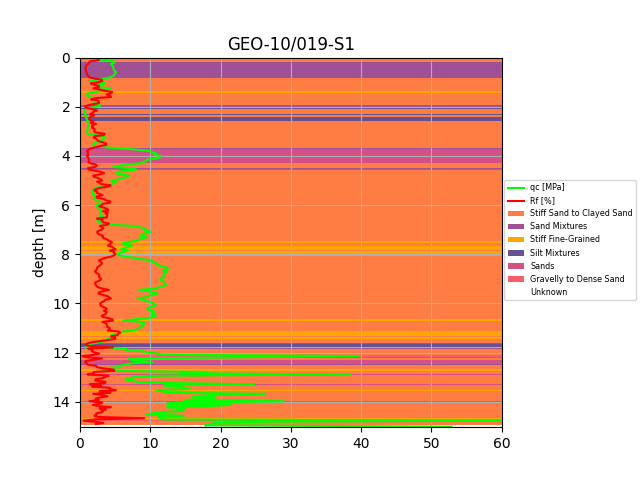

# cptlib
This is a Python library to facilitate the analysis of cone penetration tests (soil layers). In particular, all the layers of a probe can be easily retrieved and the soil behavior type is determined based on the Robertson method (2010)*. Moreover, the necessary functionality is provided such that all probes within a given geographical area, by means of a polygon, can be retrieved from the DOV (Databank Ondergrond Vlaanderen, or Database Underground Flanders).

The main file demonstrates these use cases.

*Robertson, P. K. (2010, May). Soil behaviour type from the CPT: an update. In 2nd International symposium on cone penetration testing (Vol. 2, No. 56, p. 8). Huntington Beach: Cone Penetration Testing Organizing Committee.
